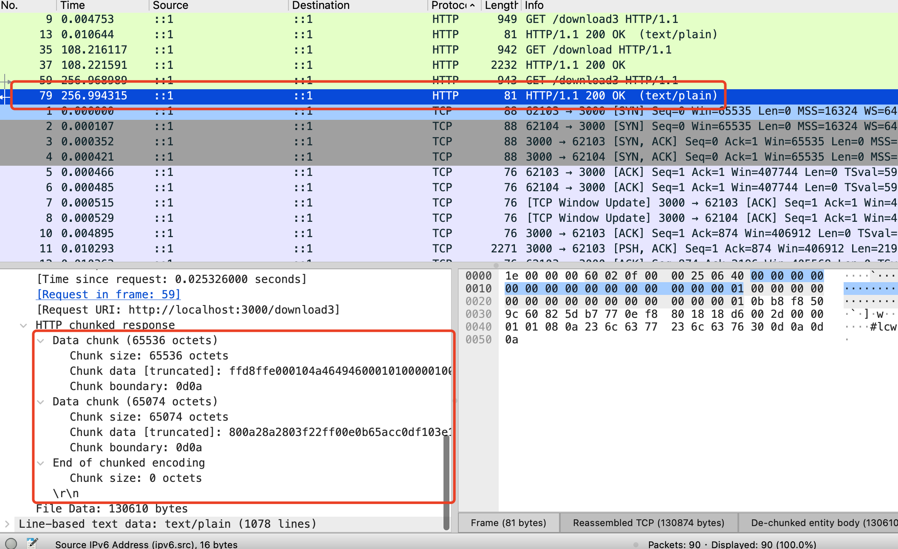

# 大文件如何实现流式下载？

大文件上传的优化是分片上传，大文件下载的优化是分片下载。

只不过这个分片下载 http 帮你做了，你只要指定 transfer-encoding:chunked 就行，也叫流式传输。

在 Nest 里可以用 fs.createReadStream 获取文件流，然后返回 StreamableFile 的对象就可以了。

返回的响应就是流式的，我们通过 wireshark 抓包证实了这点。

每个分块都有 chunk size、chunk data 的信息。

